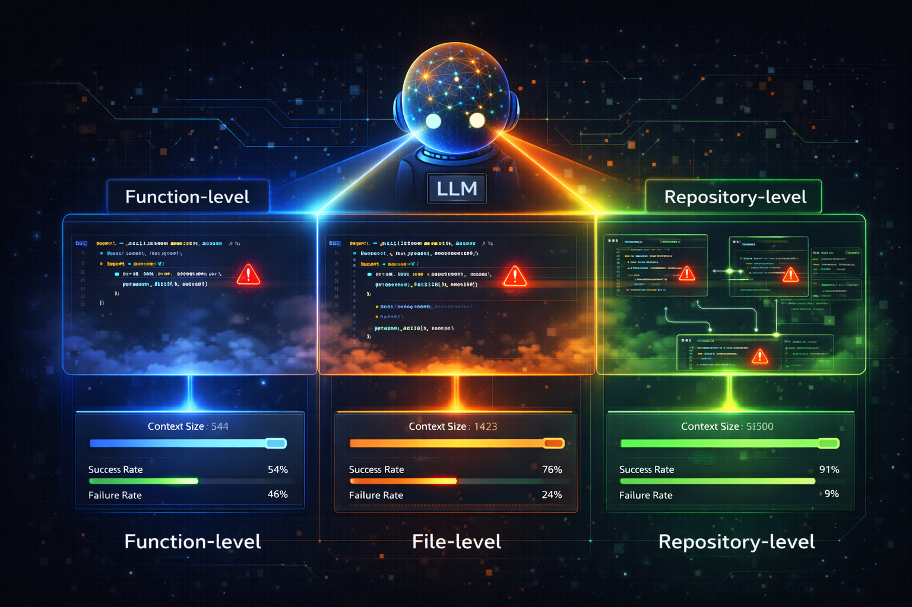

# How Much Context Is Enough? A Comparative Study of Input Scope of Code in LLM-Based Vulnerability Detection.

<!--  -->
<div align="center">
  
</div>


## Setup

### Environments

- Ubuntu 22.04
- Python >= 3.12

### Installation

1.  **Clone the repository:**
    ```bash
    git clone https://github.com/anonymous/llmvd.git
    cd llmvd
    ```

2.  **(Optional) Create and activate a virtual environment:**
    ```bash
    python -m venv env
    source env/bin/activate
    ```

3.  **Install the required packages:**
    ```bash
    pip install -r requirements.txt
    ```

4.  **Set up your API keys:**
    Copy the [.env.example](.env.example) file to `.env` and add your API keys for the models you want to use:
    ```bash
    cp .env.example .env
    ```
    Then, open `.env` and fill in your keys.

### Load Data

* [**Dataset**](https://drive.usercontent.google.com/download?id=1HfBrlC2WHsveyE5GNHyOvakQoS0_Vwn0&confirm=t)
  
    ```bash
    gdown "https://drive.google.com/uc?id=1HfBrlC2WHsveyE5GNHyOvakQoS0_Vwn0" -O data.zip
    unzip data.zip
    ```

* **(Optional)** [**Results**](https://drive.usercontent.google.com/download?id=1fwObdsBjzFMLGQMtW4wMVu1EbTthJAHi&confirm=t)

    ```bash
    gdown "https://drive.google.com/uc?id=1fwObdsBjzFMLGQMtW4wMVu1EbTthJAHi" -O results.zip
    unzip results.zip
    ```
   

## How to Use
   
```bash
python run.py [OPTIONS]
```

### Quick Start

The command below is an example from the experimental setup mentioned in our paper. 

```bash
python run.py -d data/FuncFileRepo.jsonl -m mistral-nemo:12b -l 100 -e 10
```

### Models used from our paper
The `--model` option supports the following identifiers:
- `claude-sonnet-4-5`
- `gemini-2.0-flash`
- `gpt-4o`
- `gpt-5`
- `llama3.1:8b`
- `mistral-nemo:12b`
- `phi3:14b`
- `qwen3-coder:30b`

### OPTIONS
| Short | Long            | Type  | Default                   | Description                                                      |
| ----- | --------------- | ----- | ------------------------- | ---------------------------------------------------------------- |
| `-d`  | `--dataset`     | str   | `data/FuncFileRepo.jsonl` | Path to the dataset JSONL file.                                  |
| `-s`  | `--savedir`     | str   | `results`                 | Directory where experiment results are stored.                   |
| `-m`  | `--model`       | str   | `gpt-5`                   | Model identifier to use for the chosen LLM backend.              |
| `-t`  | `--temperature` | float | `1.0`                     | Temperature setting for the LLM (default: 1.0).                  |
| `-l`  | `--limit`       | int   | `1`                       | Maximum rate limit of LLM API (e.g., max concurrent requests).   |
| `-e`  | `--executions`  | int   | `1`                       | Number of executions per combination (default: 1).               |
| `-r`  | `--reset`       | flag  | `False`                   | Reset the experiment results (overwrite / ignore existing runs). |

## Build: Multi-Function / Multi-File Dataset

To address reviewer feedback and include vulnerabilities whose fixes span multiple functions/files, we provide a dataset builder that produces a Detector-compatible JSONL while preserving multi-function/multi-file metadata.

1. Prepare a ReposVul-style JSONL (contains `cve_id`, `cwe_id`, `cve_language`, `project`, `commit_id`, `parents`, `details[*].file_name`, `details[*].code_before`, `details[*].code`, `details[*].function_before/after[*].function|line|target`, etc.). Place it under `data/ReposVul.jsonl`.

2. Build the dataset:

```bash
python -m src.utils.dataset_builder -i data/ReposVul.jsonl -o data/FuncFileRepo-MF.jsonl
```

3. Run experiments on the new dataset:

```bash
python run.py -d data/FuncFileRepo-MF.jsonl -m gpt-5 -e 10
```

Notes:
- Output schema remains compatible with the existing pipeline: `function`, `file`, `repository` (with `callee`/`caller` lists), `language`, and `vulnerable`.
- Additional metadata is included: `group_id`, `is_multi_function`, `is_multi_file`, `targets_count`, `files_count`, enabling stratified analysis.
- If call graphs are unavailable, repository context approximates related functions: same-file functions are listed under `callee`, cross-file under `caller`.

### Build: Targeted Subsets (MFSF / MFMF)

Split the MF dataset into two targeted subsets:

- MFSF (Multi-Function, Single-File): commits that modify multiple functions within a single file.
- MFMF (Multi-Function, Multi-File): commits that modify multiple functions across multiple files.

```bash
python -m src.utils.dataset_splitter -i data/FuncFileRepo-MF.jsonl \
    --mfsf data/FuncFileRepo-MFSF.jsonl \
    --mfmf data/FuncFileRepo-MFMF.jsonl
```

You can then run the experiments on each subset independently, e.g.:

```bash
python run.py -d data/FuncFileRepo-MFSF.jsonl -m gpt-5 -e 10
python run.py -d data/FuncFileRepo-MFMF.jsonl -m gpt-5 -e 10
```

### (Optional) Enrich with True Caller/Callee via CodeQL (small subset)

Prereqs: Install CodeQL CLI and C/C++ packs. Then run:

```bash
python -m src.utils.enrich_with_codeql \
    -i data/FuncFileRepo.jsonl -o data/FuncFileRepo.true.jsonl \
    -n 50 --languages c,cpp
```

Notes:
- This replaces `repository.callee/caller` for up to `-n` samples using actual edges from the checked-out repo/commit.
- The repo is auto-cloned from `https://github.com/{project}.git` (requires network).
- Templates and scripts are under `codeql/c` and `codeql/cpp`.

### (Optional) Enrich via cflow / Java-All-Call-Graph / PyCG

If you prefer open tools without CodeQL:

```bash
# Python (PyCG)
pip install pycg

# Java (java-all-call-graph)
export JACG_JAR=/path/to/java-all-call-graph.jar

# C/C++ (cflow)
sudo apt-get update && sudo apt-get install -y cflow

python -m src.utils.enrich_with_callgraph \
    -i data/FuncFileRepo.jsonl -o data/FuncFileRepo.cg.jsonl \
    -n 50 --languages c,cpp,java,python
```

Notes:
- This script uses simple parsers (heuristics) to extract edges from tool outputs and may be less precise than CodeQL.
- It falls back gracefully per-sample if a tool is unavailable or fails.

## Project Structure

```
.
├── data/                   # Datasets for experiments
├── paper/                  # Research paper source
├── results/                # Experiment results
│   ├── {model_name}/       # Results for a specific model
│   │   ├── *.jsonl         # Raw LLM outputs
│   │   └── result.csv      # Performance metrics for the model
│   ├── *.csv               # Aggregated results across all models
│   └── *.png               # Plots and visualizations
├── src/                    # Source code
│   ├── core/               # Core logic (Detector, Evaluator)
│   ├── llms/               # LLM API clients (GPT, Claude, etc.)
│   ├── prompts/            # Prompt templates
│   └── utils/              # Utility scripts
├── run.py                  # Main script to run experiments
├── expr.ipynb              # Jupyter notebook for experiments and analysis
└── README.md
```
